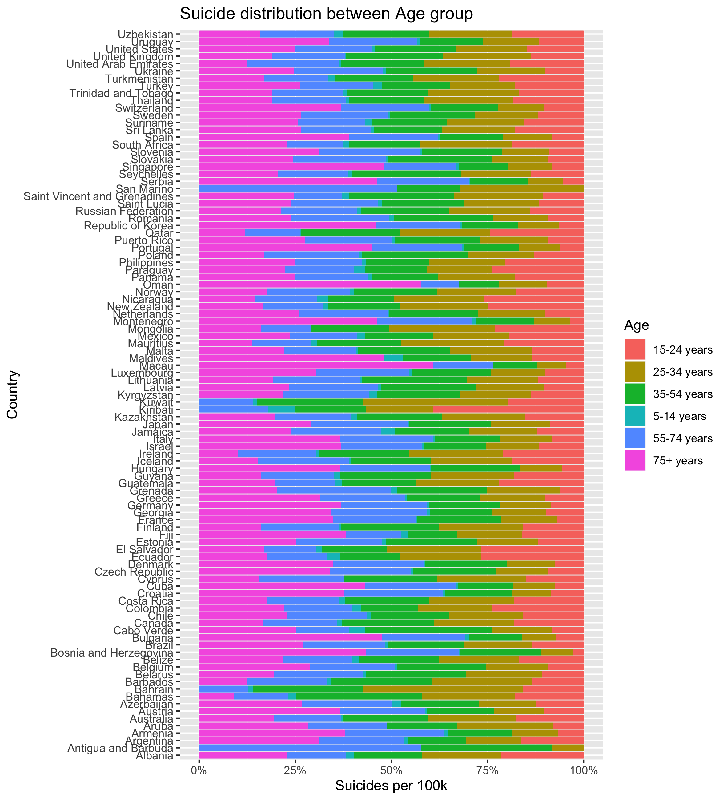
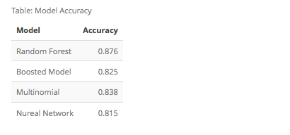
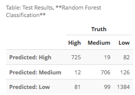

```{r setup, include=FALSE}
knitr::opts_chunk$set(echo = FALSE)
```

## Introduction

- Pulled from four data sources: United Nations Development Program, World Bank, Suicide in the Twenty-First Century, and World Health Organization

- Summarized a set of potenial factors that influence the suicide rates across the world.

- 12 variables with 27,820 observations. 

- Our focus is to predict and classfiy the suicide rate in different countries based on the factors including `age`, `sex` and `gdp for the year`

## Data Exploration

{ width=360mm }  { width=360mm }

## Regression Results

```{r}
library(png)
library(grid)
img <- readPNG("figs/Linear_byAge.png")
grid.raster(img)
```

Pay more attention to the elderly.

## Classification





- Random Forest Model has the best performance
- Misclassification rate for High: 11%
- Misclassification rate for Medium: 14% 
- Misclassification rate for Low: 13%

## Classification result

```{r}
img <- readPNG("figs/Classification Visualization.png")
grid.raster(img)
```

## Limitation and Improvement

- Include more countries for worldwide analysis 

- More classification levels 

```{r}
library(png)
library(grid)
img <- readPNG("suicide.png")
grid.raster(img)
```


